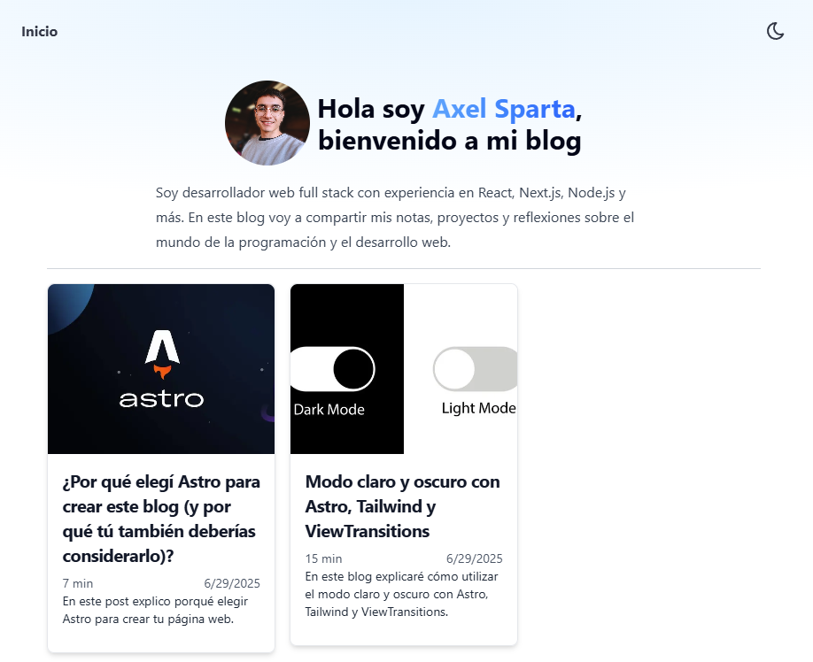

# ✍️ Blog Personal — Axel Sparta

Este es mi blog personal donde escribo sobre desarrollo web, tecnologías y mis proyectos. Está construido con [Astro](https://astro.build) y usando Tailwind CSS para los estilos.

> Deploy: [axel-sparta-blog.netlify.app](https://axel-sparta-blog.netlify.app/)

---

## 🚀 Tecnologías utilizadas

- ⚡ **Astro** — Generador de sitios estáticos ultra rápido
- 🎨 **Tailwind CSS** — Estilos rápidos y responsivos
- 📰 **Markdown (.md)** — Publicaciones gestionadas como contenido estático
- 🌗 **Modo oscuro/claro** — Con preferencia persistente

---

## ✨ Características

- 📝 Publicaciones estáticas en Markdown
- 🌙 Alternancia entre tema claro y oscuro (modo persistente)
- ⚡ Carga rápida y optimizada para SEO
- 🔧 Código modular y mantenible usando componentes Astro

---

## 📷 Preview



```bash
📁 src/
├── components/      → Componentes en Astro
├── content/blogs/   → Posts escritos en Markdown
├── layouts/         → Estructuras base del sitio
└── pages/           → Rutas del sitio
```

---

## 🧪 Instalación local

```bash
git clone https://github.com/AxelSparta/personal-blog.git
cd personal-blog
npm install
npm run dev
```

Luego, visitá http://localhost:4321 en tu navegador.

---

## 📌 Estado del proyecto

✅ Proyecto activo y en producción
📚 Se pueden agregar fácilmente nuevos artículos en la carpeta src/content/blogs

---

## 👨‍💻 Autor
Creado por [Axel Sparta](https://axelsparta.netlify.app/)
📫 Contacto: [LinkedIn](https://www.linkedin.com/in/axel-sparta-web/) | [Gmail](mailto:axelnicolassparta@gmail.com)

⭐ ¡Si te gusta el proyecto, dejá una estrella!

---
